# Notask Flow Backend

Notask Flow 后端服务，基于 Spring Boot 3.2 构建的 REST API，提供个人知识管理与团队任务协作功能。

## 技术栈

| 组件 | 技术 |
|------|------|
| 语言 | Java 21 |
| 框架 | Spring Boot 3.2.12 |
| ORM | MyBatis Plus 3.5.7 |
| 认证 | Sa-Token 1.39.0（JWT + Redis） |
| API 文档 | SpringDoc OpenAPI 2.3.0 |
| 数据库 | MySQL 8.4 |
| 缓存 | Redis 7.2 |
| 消息队列 | RabbitMQ 3.13 |
| 对象存储 | MinIO |
| 搜索引擎 | Elasticsearch 8.15.5 |
| 日志 | Log4j2 |
| 文件类型检测 | Apache Tika 3.3 |
| 协同服务 | Node.js WebSocket + Yjs 协议 |

## 项目结构

```
backend/
├── src/main/java/com/notaskflow/
│   ├── common/            # 公共枚举、常量、工具类
│   ├── config/            # Spring 配置
│   ├── controller/        # REST 控制器
│   ├── domain/            # 领域模型、仓库接口
│   ├── event/             # 事件定义
│   ├── exception/         # 全局异常处理
│   ├── job/               # 定时任务
│   ├── listener/          # 事件监听器
│   ├── mapper/            # MyBatis 映射器
│   ├── mq/                # 消息队列消费者/生产者
│   ├── repository/        # 数据访问层
│   ├── security/          # 安全/认证相关
│   ├── service/           # 业务逻辑层
│   ├── storage/           # 文件存储抽象
│   └── utils/             # 工具类
├── src/main/resources/
│   ├── application.yml           # 主配置（含 profiles.active）
│   ├── application-dev.yml       # 本地开发配置（连接 localhost）
│   ├── application-docker.yml    # Docker 环境配置（连接容器服务名）
│   ├── application-prod.yml      # 生产环境配置
│   ├── log4j2-spring.xml         # 日志配置
│   ├── db/schema.sql             # 数据库 DDL
│   ├── db/data.sql               # 初始化数据
│   └── mapper/                   # MyBatis XML 映射文件
├── docker/
│   ├── backend/Dockerfile         # 后端应用镜像
│   ├── collab-ws/Dockerfile       # 协作 WebSocket 服务镜像
│   └── frontend/
│       ├── Dockerfile             # 前端 nginx 镜像
│       └── nginx.conf             # nginx 反向代理配置
├── docker-compose.yml             # 全栈部署（--profile app 启动应用层）
├── docker-compose-dev.yml         # 仅基础设施（本地开发用）
├── .env.example                   # 环境变量模板
├── pom.xml
└── README.md
```

## 快速开始

### 前置要求

- JDK 21
- Maven 3.9+
- Docker & Docker Compose
- Linux 主机需设置 `vm.max_map_count=262144`（Elasticsearch 要求）

### 启动方式选择

| 场景 | 推荐命令 | 说明 |
|------|----------|------|
| 后端本地开发 | `docker compose -f docker-compose-dev.yml up -d` + `mvn spring-boot:run` | 基础设施在 Docker，Spring Boot 在宿主机或 IDE 中运行 |
| 全栈容器体验 | `docker compose --profile app up -d` | 前端、后端、WebSocket 和基础设施全部在 Docker 中运行 |
| 只运行测试 | `mvn test` | 使用测试配置执行后端单元/集成测试 |

### 1. 启动基础设施（本地开发）

```bash
# 复制环境变量模板
cp .env.example .env

# 按需编辑 .env 中的密码和密钥

# 启动 MySQL、Redis、RabbitMQ、MinIO、Elasticsearch、collab-ws
docker compose -f docker-compose-dev.yml up -d
```

`docker-compose-dev.yml` 会启动 MySQL、Redis、RabbitMQ、MinIO、Elasticsearch 和 `collab-ws`。后端应用仍由本机的 Maven/IDE 启动，因此 `.env` 中 `COLLAB_API_BASE_URL` 应保持为 `http://host.docker.internal:8080`。

### 2. 启动后端应用

```bash
# 默认激活 dev profile，连接 localhost 各服务
mvn spring-boot:run

# 或指定 profile
mvn spring-boot:run -Dspring-boot.run.profiles=docker
```

应用启动后访问：
- API 文档：http://localhost:8080/swagger-ui/index.html
- OpenAPI JSON：http://localhost:8080/v3/api-docs

本地联调 Web 前端时，前端应配置 `VITE_API_BASE_URL=/api/v1` 和 `VITE_COLLAB_WS_URL=/ws`，由 Vite 代理到后端和 `collab-ws`。

### 3. 全栈 Docker 部署

```bash
docker compose --profile app up -d
```

服务端口映射：

| 服务 | 端口 | 管理界面 |
|------|------|---------|
| 后端 API | 8080 | /swagger-ui/index.html |
| 前端 | 3000 | — |
| 协作 WebSocket | 8081 | — |
| MySQL | 3306 | — |
| Redis | 6379 | — |
| RabbitMQ | 5672 | 15672（管理界面） |
| MinIO API | 9000 | 9001（控制台） |
| Elasticsearch | 9200 | — |

## 配置说明

| Compose     | docker-compose-dev.yml                              | docker-compose.yml |
|-------------|----------------------------------------------------|---------------|
| **Profile** | `dev`                                              | `docker` |
| **后端运行位置**  | 宿主机（IDE / java -jar）                               | Docker 容器内 |
| **基础设施**    | Docker 容器                                          | Docker 容器 |
| **前端**      | 本地 `npm run dev`                                   | Docker 容器（nginx） |
| **服务寻址**    | `localhost` / `127.0.0.1` / `host.docker.internal` | Docker 服务名（`app`、`redis`…） |

**使用不同的docker-compose构建环境时需修改 `.env` 中的以下参数**：

| 参数 | docker-compose-dev | docker-compose |
|------|--------|--------|
| `COLLAB_API_BASE_URL` | `http://host.docker.internal:8080` | `http://app:8080` |
| `COLLAB_REALTIME_BROADCAST_URL` | `http://localhost:8081/internal/broadcast` | `http://collab-ws:8081/internal/broadcast` |
| `MINIO_ENDPOINT` | `http://127.0.0.1:9000` | `http://minio:9000` |
| `ELASTICSEARCH_ENDPOINT` | `http://127.0.0.1:9200` | `http://elasticsearch:9200` |

### Profile

| Profile | 配置文件 | 适用场景                      |
|---------|---------|---------------------------|
| `dev` | application-dev.yml | 本地开发，连接 `localhost` 各服务   |
| `docker` | application-docker.yml | Docker Compose 部署，连接容器服务名 |
| `prod` | application-prod.yml | 生产环境（自行配置）                |

`application.yml` 中 `spring.profiles.active` 默认为 `dev`，可通过环境变量 `SPRING_PROFILES_ACTIVE` 覆盖。`docker-compose.yml` 默认为 `docker`。

### 环境变量

所有可配置参数详见 `.env.example`，按模块分为：

- **Hosts & Ports** — 所有服务的主机地址和端口
- **Data Directories** — 宿主机数据持久化目录
- **MySQL / Redis / RabbitMQ / MinIO / Elasticsearch** — 各服务凭据和配置
- **Admin Console** — 管理端初始账号
- **Sa-Token / JWT** — 认证密钥
- **Web Security** — CORS、CSRF 与安全响应头
- **Collaboration Service** — 协作 WebSocket 配置
- **Mail** — 邮件服务账号和邮件链接域名
- **File Management** — 文件上传限制和清理策略

### 关键配置项

| 配置 | 作用 | 本地开发建议 |
|------|------|--------------|
| `SA_TOKEN_JWT_SECRET` | JWT 签名密钥 | 必须改成长随机字符串 |
| `ADMIN_USERNAME` / `ADMIN_PASSWORD` | 管理端登录账号 | 生产环境必须替换默认值，建议 `ADMIN_PASSWORD` 使用 BCrypt 密文或高强度随机密码 |
| `COLLAB_INTERNAL_TOKEN` | 后端和 `collab-ws` 内部调用密钥 | 后端与 `collab-ws` 必须完全一致 |
| `COLLAB_API_BASE_URL` | `collab-ws` 调后端内部接口的地址 | 本地开发用 `http://host.docker.internal:8080` |
| `COLLAB_REALTIME_BROADCAST_URL` | 后端向 `collab-ws` 广播空间事件的地址 | 本地开发用 `http://localhost:8081/internal/broadcast` |
| `SECURITY_ALLOWED_ORIGINS` | 允许访问 API 的前端来源 | 按实际 Web 域名、端口和局域网调试地址填写 |
| `MINIO_ENDPOINT` | 后端访问 MinIO 的地址 | 本地开发用 `http://127.0.0.1:9000` |
| `ELASTICSEARCH_ENDPOINT` | 后端访问 Elasticsearch 的地址 | 本地开发用 `http://127.0.0.1:9200` |
| `FILE_MAX_SIZE` | 单次请求最大上传体积 | 需要和前端上传策略、nginx 限制保持一致 |
| `FILE_MULTIPART_THRESHOLD_SIZE` | 超过该大小建议走分片上传 | 默认 50 MB |

### 配置模板与敏感信息

- `backend/.env.example` 是唯一应提交的后端环境变量模板；真实 `backend/.env`、`backend/.env.*` 已在 `.gitignore` 中忽略。
- `application.yml` 只保留占位默认值，不应写入真实 JWT 密钥、SMTP 密码、MinIO 密钥或协作内部 token。
- `application-prod.yml` 对数据库、Redis、RabbitMQ、MinIO、JWT、管理端账号和协作内部 token 使用必填环境变量；缺少这些变量时生产 profile 应直接启动失败。
- `docker-compose-dev.yml` 偏向本地开发，允许使用示例密码；`docker-compose.yml` 启动全栈前仍应先从 `.env.example` 复制 `.env` 并替换所有 `change-me`、`notask`、`minioadmin` 之类默认值。
- `COLLAB_INTERNAL_TOKEN` 必须同时提供给 Spring Boot 后端和 `collab-ws`，两侧不一致会导致协作文档 ticket 校验和空间事件广播失败。
- 邮件是否启用由管理端系统配置表中的 `mail.enabled` 控制，SMTP 连接参数仍由环境变量提供。
- 协作 ticket 过期时间由管理端系统配置 `collab.ticket-expire-seconds` 控制，不通过 `.env` 热更新。

## 核心业务模块

| 模块 | 入口 | 说明 |
|------|------|------|
| 认证与用户 | `AuthController`、`UserController` | 注册、登录、密码找回、个人资料、头像上传 |
| 空间与权限 | `SpaceController`、`StpInterfaceImpl`、`PermissionValidator` | 个人/团队空间、成员、角色、空间级 RBAC 权限 |
| 笔记 | `NoteController`、`NotebookController` | 笔记本、笔记 CRUD、分享、历史版本、全文检索 |
| 任务与待办 | `TaskController`、`TodoController` | 任务分配、认领、成员完成状态、待办联动、任务状态重算 |
| 项目 | `ProjectController` | 团队项目、项目成员、关联任务和文档 |
| 文件管理 | `FileManagementController`、`AttachmentController` | 普通上传、分片上传、预签名上传、预览、回收站、引用关系 |
| 通知 | `NotificationController` | 站内通知、邮件通知、未读数量 |
| 统计 | `StatsController` | 个人与团队任务、笔记、活动统计 |
| 协同 | `CollaborationInternalController`、`docker/collab-ws` | 协作文档票据、空间事件票据、WebSocket 广播 |

## 功能 UI 展示

**前端项目地址:https://github.com/MockMine/notask-flow-frontend**

以下截图位于 `backend/img/`，用于展示当前 Web 端主要功能页面和视觉风格。

### 认证入口

登录页使用沉浸式渐变背景与右侧表单卡片，突出 Notask Flow 的品牌入口、语言切换、记住登录和注册引导。

<p>
  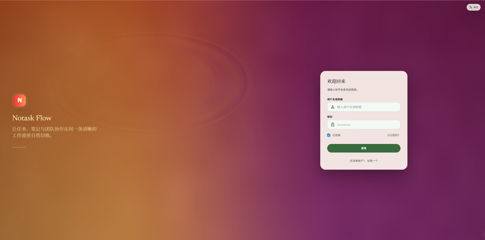
</p>


### 个人空间

个人空间用于个人知识、任务和文件的日常管理。整体采用浅绿色、米白和暖橙点缀，强调低干扰的个人专注感。

| 笔记                                                         | 任务                                                         |
| ------------------------------------------------------------ | ------------------------------------------------------------ |
| 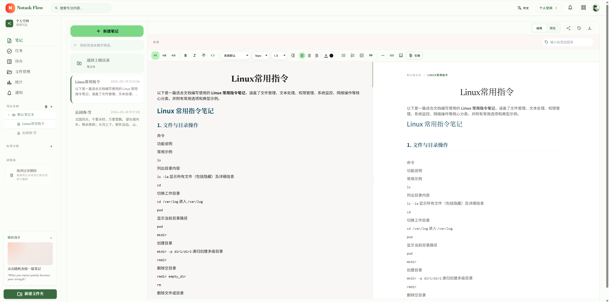 | 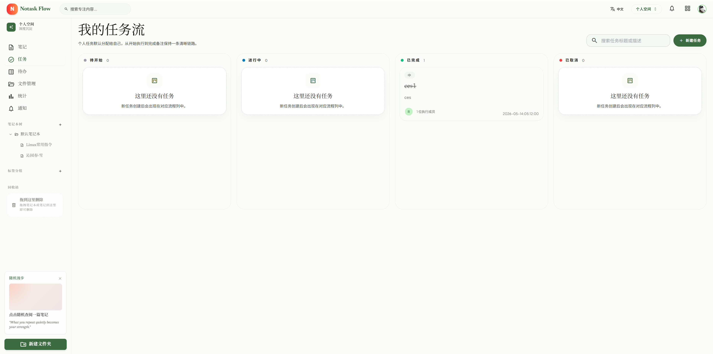 |

| 待办                                                         | 统计                                                         |
| ------------------------------------------------------------ | ------------------------------------------------------------ |
| 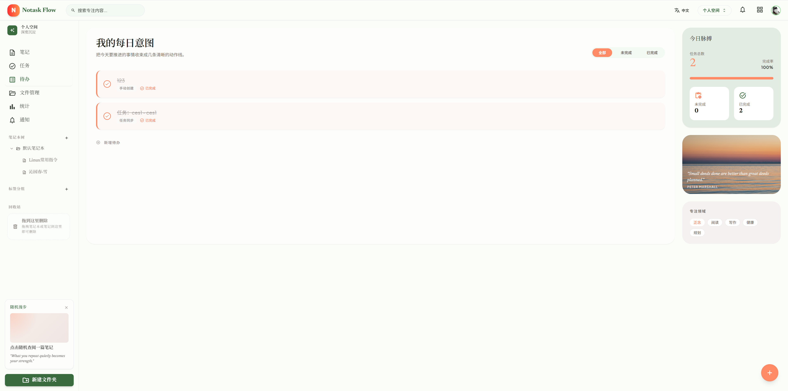 | 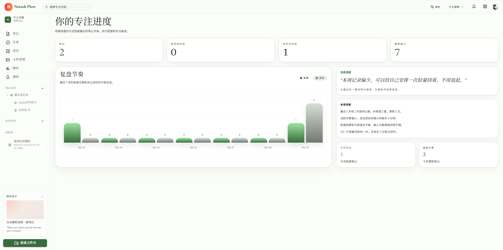 |

| 文件管理                                                     |
| ------------------------------------------------------------ |
| 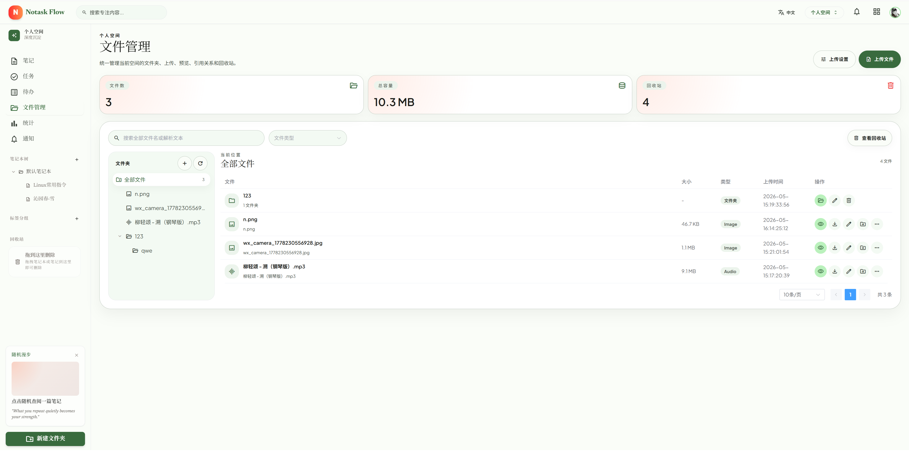 |

个人空间页面覆盖：

- **笔记**：笔记本树、标签筛选、富文本编辑、实时预览、引用、分享、历史版本和协作状态。
- **任务**：按“待开始 / 进行中 / 已完成 / 已取消”组织个人任务流，支持搜索和新建任务。
- **待办**：以“每日意图”呈现待办清单，右侧展示今日脉搏、完成率、专注领域和随机漫步卡片。
- **统计**：用复盘节奏、趋势窗口、今日专注等卡片展示最近的记录与执行情况。
- **文件管理**：提供空间内文件夹、上传、预览、下载、编辑、回收站和文件统计。

### 团队空间

团队空间用于多人协作、项目推进和共享资料管理。视觉上切换为蓝色体系，左侧导航、卡片、看板和报表更强调团队状态与协作信号。

| 报表                                                         | 成员管理                                                     |
| ------------------------------------------------------------ | ------------------------------------------------------------ |
| 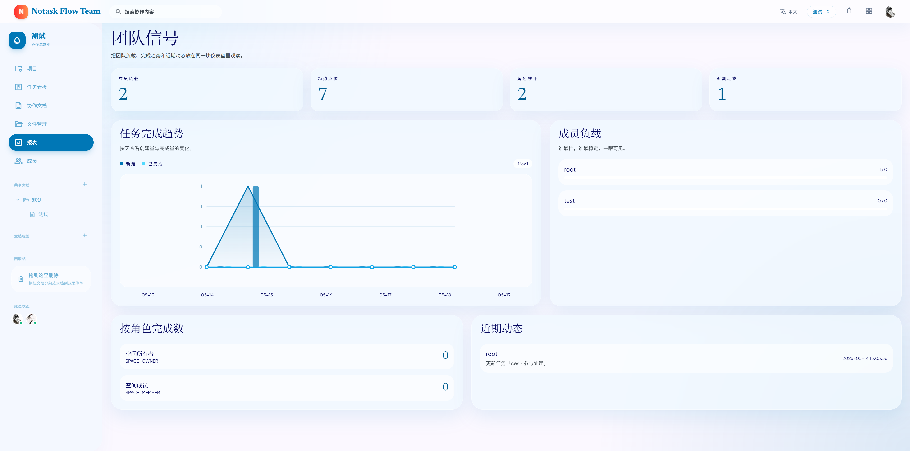 | 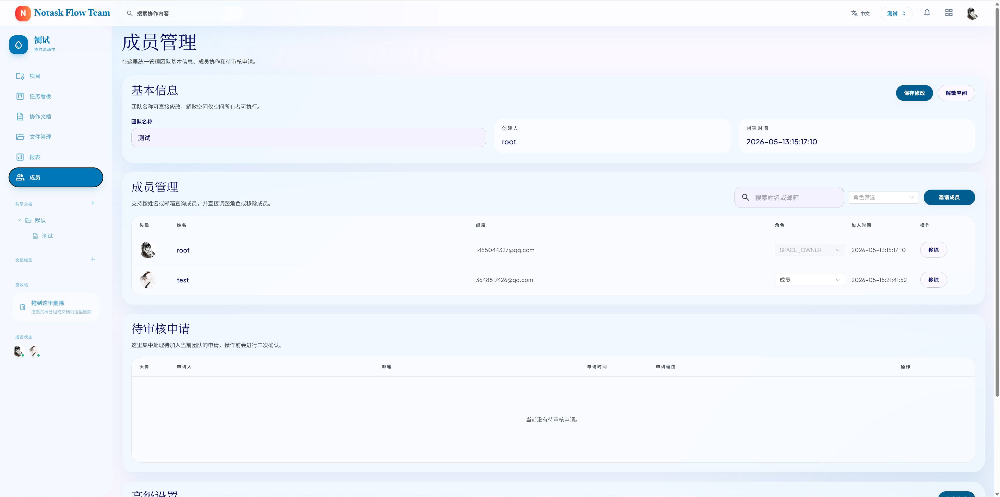 |

| 任务看板                                                     | 文档协作                                                     |
| ------------------------------------------------------------ | ------------------------------------------------------------ |
| 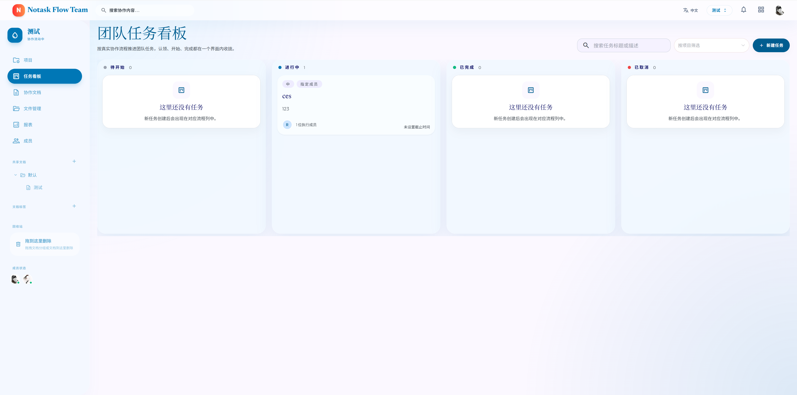 | 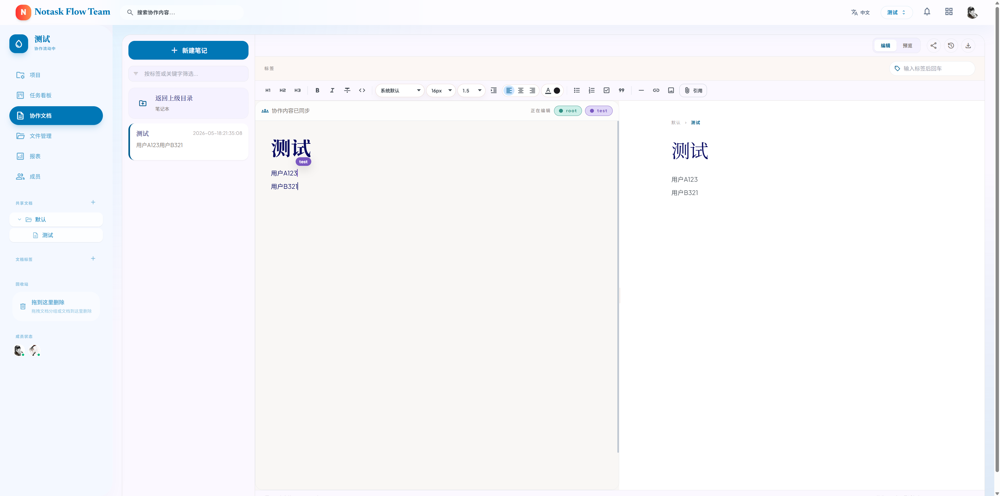 |

| 文件管理                                                     | 项目                                                         |
| ------------------------------------------------------------ | ------------------------------------------------------------ |
| 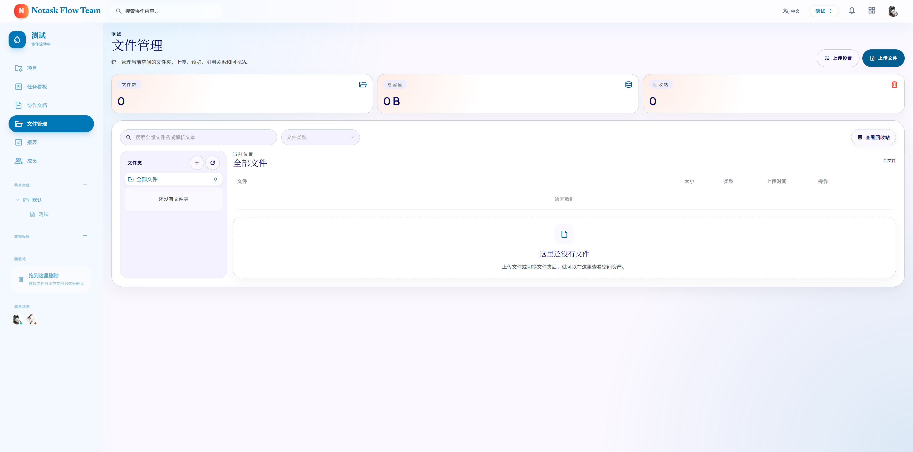 | 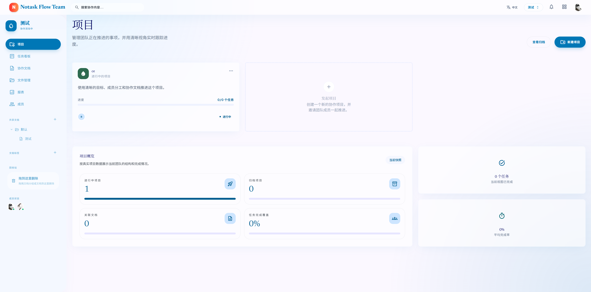 |

| 项目详情                                                     |
| ------------------------------------------------------------ |
| 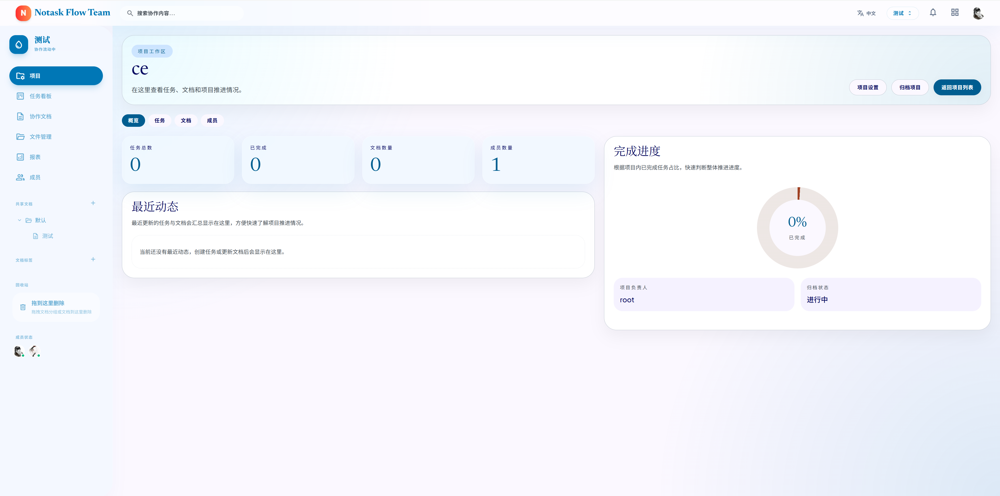 |

团队空间页面覆盖：

- **项目**：项目卡片、发起项目、项目归档、项目概览和项目进度追踪。
- **项目详情**：围绕单个项目展示概览、任务、文档、成员、完成进度、负责人和归档状态。
- **任务看板**：按协作流程展示团队任务状态，支持项目筛选、任务搜索和成员任务分配。
- **协作文档**：团队笔记列表、多人在线状态、富文本编辑区、实时预览和 Yjs 协同同步提示。
- **文件管理**：团队共享文件夹、上传、预览、回收站、空状态和共享文档树。
- **成员管理**：团队基本信息、成员角色、邀请成员、移除成员和待审核申请。
- **报表**：成员负载、任务完成趋势、角色统计和近期动态，帮助团队快速观察协作状态。

## 中间件职责速览

| 中间件 | 实现功能                                                                 | 主要代码 |
|--------|----------------------------------------------------------------------|----------|
| MySQL | 保存用户、空间、权限、笔记、任务、待办、附件、文件、通知、统计基础数据                                  | `src/main/resources/db/schema.sql`、`mapper/` |
| Redis | Sa-Token 会话与黑名单、权限缓存、协作 ticket、空间事件 ticket、文件上传会话、限流、MQ 消费幂等、笔记浏览量增量 | `RedisConfig`、`RedisUtil`、`RedisKeyConstants` |
| RabbitMQ | 异步处理任务事件、通知、邮件、搜索索引、文件处理、统计刷新，并通过死信队列和失败日志支撑重试                       | `RabbitMqConfig`、`mq/producer/`、`mq/consumer/` |
| MinIO | 头像、附件、空间文件对象存储，提供预签名上传/下载和文件预览资源                                     | `MinioConfig`、`MinioStorageService` |
| Elasticsearch | 笔记与文件全文检索，文件索引包含 Tika 提取正文                                           | `ElasticsearchConfig`、`domain/document/`、`Elasticsearch*SearchServiceImpl` |
| collab-ws | 承载 Yjs 协作文档同步和空间实时事件连接，票据通过后端内部接口校验                                  | `docker/collab-ws/src/server.js` |
| Mail SMTP | 异步发送注册验证码、密码重置、团队通知等邮件                                               | `MailEventConsumer`、`MailNotificationService` |

## API 约定

- 基础路径为 `/api/v1`。
- 鉴权头为 `Authorization: Bearer <jwt>`。
- 业务接口统一返回 `ApiResponse<T>`：

```json
{
  "code": 200,
  "message": "success",
  "data": {}
}
```

- 分页接口使用 `pageNum` 和 `pageSize`，默认从第 1 页开始。
- 大部分业务资源都挂在空间下，路径形如 `/api/v1/spaces/{spaceId}/notes`。
- 内部接口位于 `/api/v1/internal/...`，只允许 `collab-ws` 等服务携带内部 token 调用。

## 事件处理模型

后端在核心事务中只完成强一致的数据库写入；对搜索索引、通知、邮件、统计刷新、文件正文抽取等耗时或可最终一致的工作，先发布 Spring 应用事件，再由 `@TransactionalEventListener(phase = AFTER_COMMIT)` 投递到 RabbitMQ。

消费者使用手动 ACK，并用 Redis 记录已消费事件 ID，避免重复消费导致重复通知、重复索引或重复统计。消费失败时会写入 `EventFailLog`，后续由 `EventFailRetryJob` 定时重投。

## 数据库初始化与变更

- 首次启动 MySQL 容器时，Compose 会执行 `src/main/resources/db/schema.sql` 和 `src/main/resources/db/data.sql`。
- `src/main/resources/db/patch/` 保存后续补丁 SQL，目前没有接入 Flyway 或 Liquibase，需要手动按文件名顺序执行。
- 如果修改表结构，应同步更新实体类、Mapper、VO/DTO、初始化 SQL 和必要的补丁 SQL。
- 逻辑删除字段为 `is_deleted`，业务查询应继续使用 MyBatis-Plus 的逻辑删除能力。

## 排障速查

| 现象 | 优先检查 |
|------|----------|
| 后端启动失败，提示 MySQL 连接错误 | `.env` 中 `MYSQL_URL`、`MYSQL_USERNAME`、`MYSQL_PASSWORD` 是否和容器一致 |
| Redis 认证失败 | `REDIS_PASSWORD` 是否同时匹配 Compose 和 `application-dev.yml` |
| 登录后仍被踢回登录页 | JWT 密钥是否变化，Redis 中旧会话是否仍存在，前端 token 是否清空 |
| 协同编辑无法连接 | `collab-ws` 是否健康，`COLLAB_INTERNAL_TOKEN` 是否一致，前端 `/ws` 是否代理到 8081 |
| RabbitMQ 消息不消费 | 管理界面 `http://localhost:15672` 查看队列堆积和消费者状态 |
| 文件预览失败 | MinIO bucket 是否创建，`MINIO_ENDPOINT` 是否正确，附件元数据和对象路径是否一致 |
| 搜索无结果 | Elasticsearch 是否健康，索引是否创建，相关 MQ 消费是否失败 |
| Elasticsearch 容器启动失败 | Linux 主机是否设置 `vm.max_map_count=262144`，内存是否足够 |

## 生产注意事项

- 必须替换 `.env.example` 中所有默认密码、JWT 密钥和内部 token。
- Redis 已开启 AOF，用于保留登出黑名单和关键短状态；生产环境仍需配置数据卷备份。
- Elasticsearch 在示例 Compose 中关闭了安全认证，生产环境需要开启认证或放入受控内网。
- MinIO 默认账号仅用于开发，应改为强密码并配置 bucket 访问策略。
- 邮件账号、对象存储密钥、JWT 密钥不应提交到代码仓库。
- 对外部署时应通过 HTTPS 暴露前端、API 和 WebSocket。

## 开发入口建议

1. 从 `config/` 理解基础设施配置。
2. 从 `security/` 理解 Sa-Token 与空间权限。
3. 从 `service/impl/` 阅读业务主流程。
4. 从 `listener/` 与 `mq/` 阅读异步事件链路。
5. 从 `docker-compose-dev.yml` 和 `docker-compose.yml` 区分本地开发与全栈容器部署。
